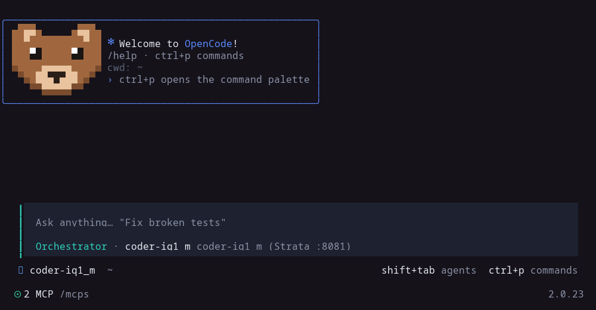

# opencode-neo-bear

A modern, Claude Code–style look for the [OpenCode](https://opencode.ai) v2 terminal UI: a cool
**neo** colour theme, a home screen with a little pixel-art bear in a welcome box at the top and
the prompt stretched along the bottom, and a clickable model switcher.



## What's inside

| Path | What it does |
|---|---|
| `themes/neo.json` | The **neo** theme: blue, teal and lavender accents on cool greys, transparent background. |
| `plugins/neo-bear/` | TUI plugin. Hides the big logo, puts a welcome box with the bear at the top and the prompt full-width at the bottom; shows `✻ Noodling… (12s · esc to interrupt)` while the model works; a bear in the sidebar that glances around while working and closes its eyes when idle. Colours follow whatever theme is active. |
| `plugins/model-button/` | TUI plugin. A clickable `⇄ <model>` in the prompt footer that opens the model list. |

## Install

Needs OpenCode **v2** (tested on 2.0.23). In v2 the TUI reads `~/.config/opencode/cli.json`.

### One command

```sh
curl -fsSL https://raw.githubusercontent.com/GbaGuy/opencode-neo-bear/main/install.sh | sh
```

It copies the theme and plugins into `~/.config/opencode` (or `$XDG_CONFIG_HOME/opencode`), sets
the theme to neo and adds the plugins to `cli.json`, keeping everything else you have. A file it
replaces is kept as `.bak`. Running it again is safe. Needs `python3`, `curl` and `tar`. Then
quit and reopen OpenCode. (From a clone, `./install.sh` does the same without downloading.)

### Let OpenCode install it

Open OpenCode and send it this message:

```text
Install opencode-neo-bear for me by following https://raw.githubusercontent.com/GbaGuy/opencode-neo-bear/main/INSTALL.md
```

It downloads the files, copies them into your config, and adds the theme and plugins to
`cli.json` without touching anything else. Then quit and reopen OpenCode.
[`INSTALL.md`](INSTALL.md) is the step-by-step guide it follows, if you want to read it first.

### Manual install

```sh
git clone https://github.com/GbaGuy/opencode-neo-bear
cd opencode-neo-bear
mkdir -p ~/.config/opencode/themes ~/.config/opencode/tui-plugins
cp themes/neo.json ~/.config/opencode/themes/
cp -r plugins/neo-bear plugins/model-button ~/.config/opencode/tui-plugins/
```

Then add the theme and the two plugin folders to `~/.config/opencode/cli.json` (use absolute
paths; keep any plugins you already have in the list):

```json
{
  "$schema": "https://opencode.ai/v2/cli.json",
  "theme": { "name": "neo" },
  "plugins": [
    "/home/YOU/.config/opencode/tui-plugins/model-button",
    "/home/YOU/.config/opencode/tui-plugins/neo-bear"
  ]
}
```

Restart OpenCode. Switch themes any time with `/theme`; the bear's box follows the theme colours.

## Notes

- A plugin folder's TUI entry must be named `tui.tsx`; OpenCode compiles it itself, no build step.
- The home-screen rearrangement works with OpenCode's current home layout. If an update changes
  it, the plugin leaves the stock home screen alone instead of breaking it.
- The bear is drawn with half-block characters (`▀`), so it needs a terminal with truecolor.
- Customise the bear: edit the `SPRITE` grid in `plugins/neo-bear/tui.tsx`. Each letter is a
  pixel: `B` fur, `S` shade, `T` muzzle / inner ear, `N` nose, `E` eye, `W` eye glint, `.` empty.

## License

MIT
